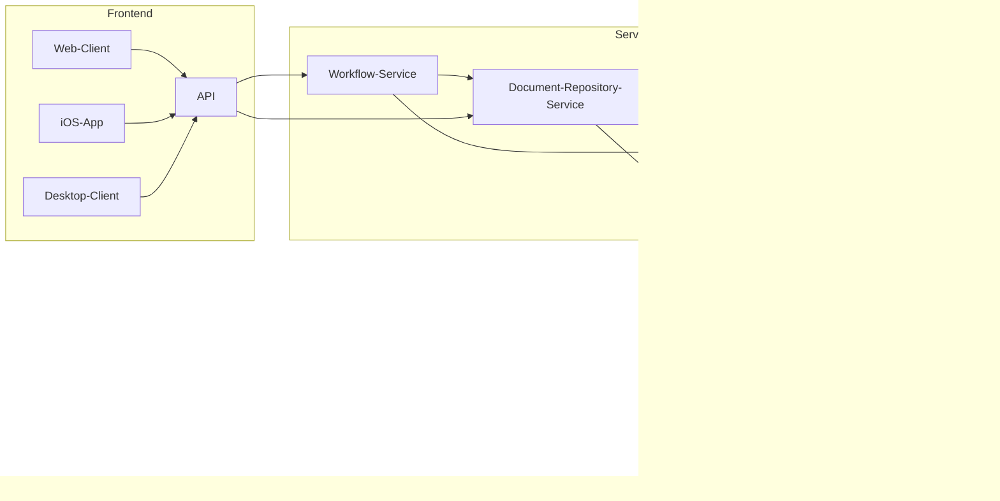

# Architecture of Innihald
An overview over the architecture of innihald.

## Services

```mermaid
graph LR

doc["Document-Repository-Service"]
file["File-Service"]
workflow["Workflow-Service"]

worker["Async-Worker"]

s3["Amazon S3"]
fs["Filesystem"]
share["Network-Share"]

api["API"]
web["Web-Client"]
app["iOS-App"]
client["Desktop-Client"]

subgraph Services
doc --> file
doc --> worker

workflow --> doc
workflow --> worker

file --> worker
end
api --> doc
api --> workflow

subgraph Frontend
web --> api
app --> api
client --> api
end

subgraph Files
file -.-> s3
file -.-> fs
file -.-> share
end
```